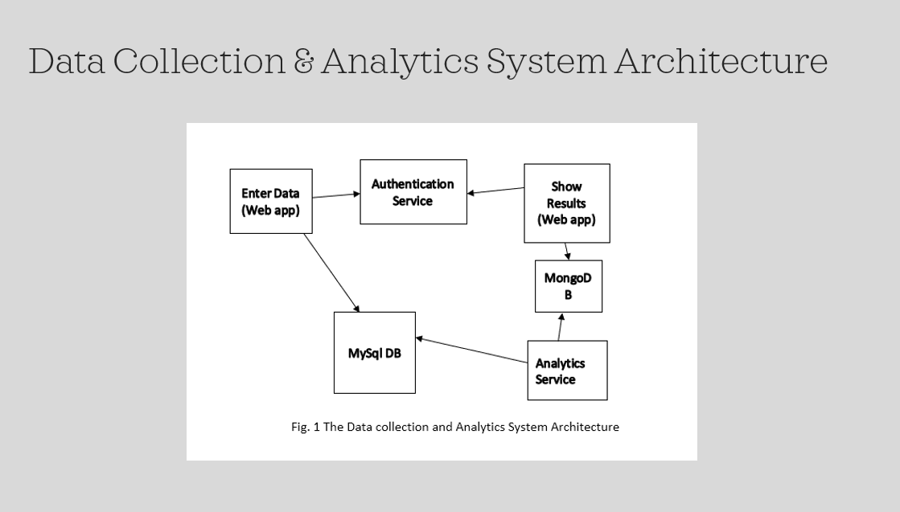

# ACIT 3495 Project 1: Docker Microservices Deployment (local)

 
### Overview 

**Microservice Components:**

  - enter-grades-app:
    - Authenticated web app 
    - Sends student name & grade to MySQL DB

  - auth-service:
    - authenticates & authorizes user for enter-grades-app
  
  - analytics-service:
    - Connects to MySQL & MongoDB
    - Retrieves Student data from MySQL DB
    - “Computes” simple stats of grades of students & posts to MongoDB

  - show-results-app:
    - Connects to MongoDB & renders stats / student grades to webpage

### Infrastructure of Microservices

